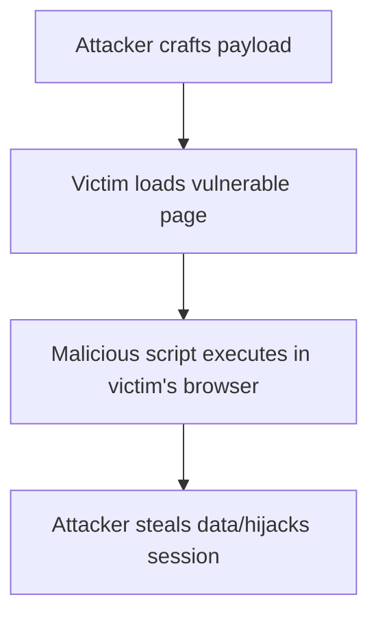

---
[🏠 Home](../../../../README.md) / [🌐 Web Application Security](../) / [🔎 Cross-Site Scripting](./notes.md)

[⬅️ Previous](../1.01-input-validation-injection/notes.md) | [➡️ Next](../1.03-authentication-session/notes.md)
---

# 1.2 Cross-Site Scripting (XSS)

## 🔍 Overview
Cross-Site Scripting (XSS) is a vulnerability that allows attackers to inject malicious scripts into web pages viewed by other users. These scripts execute in the victim's browser, enabling theft of cookies/session tokens, account hijacking, defacement, phishing, and more. XSS is one of the most common and impactful web vulnerabilities.

---

## 🧨 Types of XSS

### 1. Stored XSS (Persistent)
- Malicious script is permanently stored on the target server (e.g., in a database, comment field).
- Victims retrieve and execute the script when viewing the affected page.
- **Example:** Attacker posts a comment with `<script>stealCookies()</script>`; all users viewing the comment run the script.

### 2. Reflected XSS (Non-Persistent)
- Malicious script is reflected off the web server (e.g., in a search result or error message).
- Delivered via URL or form input; executed immediately in the victim's browser.
- **Example:** User clicks a crafted link: `https://site.com/search?q=<script>alert(1)</script>`

### 3. DOM-Based XSS
- Vulnerability exists in client-side JavaScript, not server-side code.
- The browser executes malicious scripts due to unsafe DOM manipulation (e.g., writing untrusted data to `innerHTML`).
- **Example:**
  ```js
  document.body.innerHTML = location.hash;
  ```

---

## 🗺️ Attack Flow & Real-World Impact


- **Session hijacking** (steal cookies, impersonate users)
- **Credential theft**
- **Defacement**
- **Phishing** (fake login forms)
- **Browser exploitation**

---

## 🧪 Payloads & Filter Evasion
- `<script>alert(1)</script>`
- ``
- `<svg/onload=alert(1)>`
- `<a href="javascript:alert(1)">click</a>`
- Obfuscation: `jaVaScRiPt:alert(1)`
- URL Encoding: `%3Cscript%3Ealert(1)%3C%2Fscript%3E`
- JS Events: `onerror`, `onload`, `onclick`, etc.
- Payload nesting: breaking out of attributes or contexts

---

## 🚫 CSP Bypass & Advanced Techniques
- Use `data:` or `blob:` URIs
- Inject into pages with weak or wildcard CSP rules (e.g., `script-src *`)
- Exploit inline script injection if `unsafe-inline` is allowed
- Chain with DOM-based XSS to bypass restrictions

---

## 🛡️ Mitigation Strategies
- **Output encoding/escaping** (HTML, JS, CSS, URL)
- **Content Security Policy (CSP)**
- **HTTPOnly & Secure cookies**
- **Input validation & sanitization**
- **Framework auto-escaping** (React, Angular, etc.)
- **Avoid dangerous sinks** (`innerHTML`, `document.write`, `eval`, etc.)
- Use a secure templating engine that auto-escapes output
- Sanitize user input using libraries like DOMPurify (client-side) or OWASP Java Encoder (server-side)

---

## 🎯 Interview Points
- Always ask: Where is user input reflected? Is it encoded?
- Know the difference between stored, reflected, and DOM XSS
- Be able to explain real-world impact and defense-in-depth
- Understand browser security features (CSP, cookie flags)
- Discuss filter evasion and CSP bypass techniques

---

## 📚 References
- [OWASP XSS Cheat Sheet](https://cheatsheetseries.owasp.org/cheatsheets/Cross_Site_Scripting_Prevention_Cheat_Sheet.html)
- [PortSwigger XSS Labs](https://portswigger.net/web-security/cross-site-scripting)
- [MDN: XSS](https://developer.mozilla.org/en-US/docs/Glossary/Cross-site_scripting)