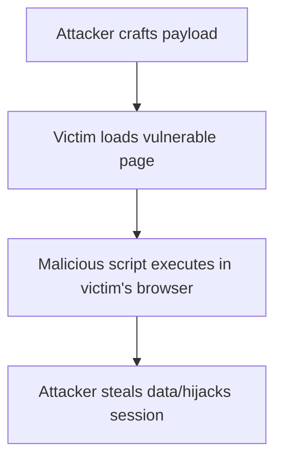
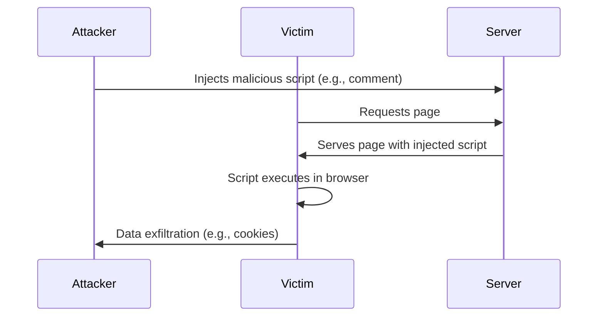

# 1.02 Cross-Site Scripting (XSS)

## What is XSS?
Cross-Site Scripting (XSS) is a vulnerability that allows attackers to inject malicious scripts into web pages viewed by other users. These scripts can steal cookies, hijack sessions, deface websites, or redirect users to malicious sites.

---

## Types of XSS

### 1. **Stored XSS (Persistent)**
- Malicious script is permanently stored on the target server (e.g., in a database, comment field).
- Victims retrieve and execute the script when viewing the affected page.
- **Example:** Attacker posts a comment with ``; all users viewing the comment run the script.

### 2. **Reflected XSS (Non-Persistent)**
- Malicious script is reflected off the web server (e.g., in a search result or error message).
- Delivered via URL or form input; executed immediately in the victim's browser.
- **Example:** User clicks a crafted link: `https://site.com/search?q=`

### 3. **DOM-based XSS**
- Vulnerability exists in client-side JavaScript, not server-side code.
- The browser executes malicious scripts due to unsafe DOM manipulation.
- **Example:** JS reads from `location.hash` and writes directly to `innerHTML`.

---

## XSS Attack Flow

---

## Real-World Impact
- **Session hijacking** (steal cookies, impersonate users)
- **Credential theft**
- **Defacement**
- **Phishing** (fake login forms)
- **Browser exploitation**

---

## Common XSS Payloads
- ``
- ``
- `<svg/onload=alert(1)>`

---

## Defense Strategies
- **Output encoding/escaping** (HTML, JS, CSS, URL)
- **Content Security Policy (CSP)**
- **HTTPOnly & Secure cookies**
- **Input validation & sanitization**
- **Framework auto-escaping** (React, Angular, etc.)
- **Avoid `innerHTML`/`document.write`**

---

## Interview Points
- Always ask: Where is user input reflected? Is it encoded?
- Know the difference between stored, reflected, and DOM XSS
- Be able to explain real-world impact and defense-in-depth
- Understand browser security features (CSP, cookie flags)

---

## Diagram: XSS Exploit Lifecycle

---

## References
- [OWASP XSS Cheat Sheet](https://cheatsheetseries.owasp.org/cheatsheets/Cross_Site_Scripting_Prevention_Cheat_Sheet.html)
- [PortSwigger XSS Labs](https://portswigger.net/web-security/cross-site-scripting)
- [MDN: XSS](https://developer.mozilla.org/en-US/docs/Glossary/Cross-site_scripting)
